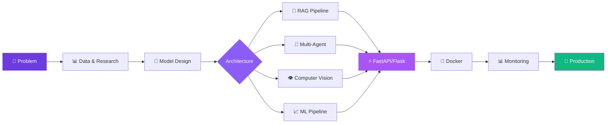

<div align="center">

<!-- ANIMATED HEADER -->


<!-- TYPING SVG -->
<a href="https://git.io/typing-svg"></a>

<br/>

<!-- SOCIAL BADGES -->
[](https://vigneshbalamurugan.me)
[](https://linkedin.com/in/vignesh-balamurugan)
[](mailto:vigneshbalamurugan.m23@iiits.in)
[](https://instagram.com/vicky.mub)

<br/>

<!-- PROFILE VIEWS & FOLLOWERS -->

<a href="https://github.com/mbvb1312?tab=followers"></a>

</div>

---

##  About Me

```yaml
Name: Vignesh Balamurugan M.B
Location: Chennai, India
Education: B.Tech — Artificial Intelligence & Data Science @ IIIT Sri City
Research: Summer Intern @ NIT Trichy (Vision Transformers + LSTMs)
Focus: LLM Orchestration | RAG Engineering | Agentic AI | Knowledge Graphs
Paper: Human Activity Recognition (under review)
Pronouns: he/him
Fun Fact: I touch grass frequently 🌱
```

> *AI/ML Engineer with hands-on experience in deep learning, NLP, LLM orchestration, RAG systems, and production-grade deployment. Proven track record through a research internship at NIT Trichy — delivering **18% accuracy improvement** and **22% inference latency reduction**. Passionate about building intelligent systems that solve real-world problems at scale.*

---

## 🏗️ What I'm Building

<table>
<tr>
<td width="50%" valign="top">

### 🔮 Core Focus Areas
- 🧠 **Multi-Agent LLM Orchestration** — Sequential, Parallel, DAG & Hierarchical topologies
- 🔗 **RAG Engineering** — Multi-hop retrieval, evidence synthesis, knowledge graphs
- 🤖 **Agentic AI** — Self-healing loops, LLM-as-judge, tool-augmented agents
- 📊 **Context & Prompt Engineering** — Advanced prompt design for production systems
- 🌐 **LangGraph & Graph-Based Models** — Graph-native reasoning pipelines

</td>
<td width="50%" valign="top">

### 🎯 Currently Working On
- 🚀 **Meta-Agent Framework** — Dynamic multi-agent pipeline orchestration
- 📝 **STRIDE Research Paper** — Lane detection via motion-derived inference
- 🛡️ **Responsible AI** — Bias mitigation in deep learning systems
- 🏙️ **Smart City AI** — GIS-based urban safety intelligence
- 💼 **Enterprise AI Platforms** — Production-grade multi-agent systems

</td>
</tr>
</table>

---

## 🛠️ Tech Arsenal

<div align="center">

### 🧠 AI / ML / DL


### 🔧 Backend & Infrastructure


### 🎨 Frontend & Visualization


### ⚙️ MLOps & DevOps


</div>

---

## 🚀 Featured Projects

<div align="center">

> *Click on any project card to explore the repository*

</div>

<table>
<tr>
<td width="50%" valign="top">

### 🔗 [RAG Fact Verification System](https://github.com/mbvb1312/RAG-FACT-VERIFICATION-USING-DEBERTA-AND-WIKIPEDIA-EMBEDDING-)


> **Multi-hop fact verification** with Wikipedia retrieval, DeBERTa-v3 NLI, and hybrid TF-IDF/DPR search fused via RRF

**Architecture Highlights:**
- 🔄 3-hop iterative evidence chain building
- 🧬 Cross-reference evidence synthesizer
- ⚖️ Intelligent weighted NLI voting system
- 📊 Prometheus + Grafana monitoring stack
- 🔬 MLflow experiment tracking + LoRA fine-tuning
- 🐳 Docker Compose full-stack deployment
- ✅ CI/CD via GitHub Actions

`Python` `FastAPI` `DeBERTa` `FAISS` `DPR` `Docker` `MLflow`

</td>
<td width="50%" valign="top">

### 🛡️ [Ethical AI — Bias Mitigation Pipeline](https://github.com/mbvb1312/ETHICAL-AND-RESPONSIBLE-AI-BIAS-MITIGATION-PIPELINE-)


> **End-to-end fairness audit** of deepfake detection — bias detection, mitigation & explainability

**Key Results:**
- 📉 Reduced Equal Opportunity gap from **~26% → ~3.5%**
- 🎯 Only **2-3% accuracy trade-off** for massive fairness gains
- 🔍 4 fairness metrics × 2 demographic attributes
- 🧠 Grad-CAM explainability visualizations
- 📊 Multi-objective threshold calibration
- 🌐 Flask + Streamlit interactive dashboards
- 📄 Full technical report included

`TensorFlow` `ResNet50` `Grad-CAM` `Flask` `Streamlit` `SciPy`

</td>
</tr>

<tr>
<td width="50%" valign="top">

### 👁️ [Crowd Stampede Risk Predictor](https://github.com/mbvb1312/COMPUTER-VISION---stampede-RISK-region-prediction)


> **Real-time stampede risk detection** from aerial drone footage using deep learning

**Architecture:**
- 🏗️ Dual-Head CANNet (ResNet-34 FPN backbone)
- 📍 Density estimation + person localization heads
- 🎬 Temporal grid-based risk assessment
- 🚁 Optimized for aerial surveillance constraints
- 📊 Multi-scale Context Module for global semantics
- 📹 Video & image stream support

`PyTorch` `ResNet-34` `FPN` `OpenCV` `CUDA`

</td>
<td width="50%" valign="top">

### 🗺️ [Chennai Night Safety Intelligence](https://github.com/mbvb1312/GIS-GEOSPATIAL_GOOGLE-MAP-ALTERNATIVE-)


> **GIS-based safety routing** — alternative to Google Maps with safety-distance trade-off

**Pipeline:**
- 🌍 12+ geospatial datasets integrated (CCTV, police, streetlights, crime)
- 🤖 Spatial-context MLP with 9-channel neighborhood features
- 🛣️ Route-risk comparison engine
- 📉 **10.5% peak risk reduction** achieved
- 🗺️ Interactive web map visualization
- 📊 Multi-criteria safety classification (5 classes)

`Python` `QGIS` `GeoPandas` `Folium` `Scikit-learn`

</td>
</tr>

<tr>
<td width="50%" valign="top">

### 🧬 [RL for CRISPR Gene-Editing](https://github.com/mbvb1312/REINFORCEMENT_LEARING-AGENT-FOR-GENE-EDITING)


> **CRISPR gene-editing optimization** modeled as MDP with drift-aware hybrid RL

**Methods:**
- 📐 Value Iteration + Policy Iteration (Model-Based)
- 🎲 SARSA with ε-greedy exploration (Model-Free)
- 🔄 Dyna-style Q-learning with drift model (Hybrid)
- 📈 Non-stationary target drift handling
- 🎬 Policy evolution animations (GIF/MP4)

`Python` `NumPy` `Matplotlib` `RL` `MDP`

</td>
<td width="50%" valign="top">

### 🔗 [LinkSnip — URL Shortener + Product Intelligence](https://github.com/mbvb1312/LinkSnip)


> **Dual-module Flask app** — smart URL shortener + cross-platform product analysis engine

**Features:**
- 🔗 URL shortening with custom aliases, expiry, QR codes
- 🛒 Amazon + Flipkart cross-platform scraping
- 💬 NLP sentiment analysis on product reviews
- 📊 Interactive Chart.js visualizations
- 🎨 Dark glassmorphism UI (850+ lines CSS)
- 🔐 JWT auth with PBKDF2-SHA256

`Flask` `BeautifulSoup` `NLP` `Chart.js` `SQLite`

</td>
</tr>

<tr>
<td width="50%" valign="top">

### 🚗 [STRIDE — Intelligent Transportation](https://github.com/mbvb1312/inteligent_transportation)


> **13-stage rule-based lane detection** from surveillance cameras — zero training data needed

**Innovations:**
- 🏗️ 2-tier parallel virtual lattice (8×8 ROI grid)
- 📐 Von Mises Mixture Model for angular clustering
- 🔬 Edge-preserving guided-filter smoothing
- 📊 **0.70 IoU** | **6.0° direction error**
- 🎯 Top-3 finish in 83% of 47 test scenes
- 📝 Paper targeting IEEE AVSS / T-ITS

`Python` `OpenCV` `NumPy` `SciPy` `NetworkX`

</td>
<td width="50%" valign="top">

### ⚡ [FastAPI Task Manager](https://github.com/mbvb1312/FAST-API-TASK-MANAGER-)


> **Production-deployed** JWT-authenticated task management with React frontend

**Stack:**
- 🔐 JWT auth with bcrypt password hashing
- ⚡ FastAPI + SQLAlchemy + Pydantic
- ⚛️ React (Vite) frontend
- 🐘 PostgreSQL (prod) / SQLite (test)
- 🐳 Docker + multi-stage builds
- ✅ 13 passing pytest tests
- 🌐 [**Live Demo →**](https://fastapi-task-manager-7c7a.onrender.com)

`FastAPI` `React` `PostgreSQL` `Docker` `Render`

</td>
</tr>
</table>

---

## 🎓 Research & Publications

<div align="center">

| 📄 Research | 🏛️ Institution | 📋 Status |
|:---:|:---:|:---:|
| **Human Activity Detection & Recognition** using Vision Transformers + LSTMs | NIT Trichy (Prof. M Sridevi) | 📝 Under Review |
| **STRIDE** — Motion-Derived Lane Inference from Surveillance Cameras | IIIT Sri City | 📝 Targeting IEEE AVSS / T-ITS |

</div>

---

## 🏆 Certifications

<div align="center">


</div>

---

## 📊 GitHub Analytics

<div align="center">


<br/>


</div>

<!-- CONTRIBUTION SNAKE -->
<div align="center">
<picture>
  <source media="(prefers-color-scheme: dark)" srcset="https://raw.githubusercontent.com/mbvb1312/mbvb1312/output/github-snake-dark.svg" />
  <source media="(prefers-color-scheme: light)" srcset="https://raw.githubusercontent.com/mbvb1312/mbvb1312/output/github-snake.svg" />
  
</picture>
</div>

---

## 🏛️ System Architecture — How I Think



---

## 📬 Let's Connect

<div align="center">

| 🌐 | 📧 | 💼 | 📸 | 📱 |
|:---:|:---:|:---:|:---:|:---:|
| [**vigneshbalamurugan.me**](https://vigneshbalamurugan.me) | [**vigneshbalamurugan.m23@iiits.in**](mailto:vigneshbalamurugan.m23@iiits.in) | [**LinkedIn**](https://linkedin.com/in/vignesh-balamurugan) | [**@vicky.mub**](https://instagram.com/vicky.mub) | [**mbvb1312@gmail.com**](mailto:mbvb1312@gmail.com) |

<br/>

**💡 Open to collaborations on AI/ML projects, research opportunities, and full-time roles in AI Engineering.**

<br/>


</div>
